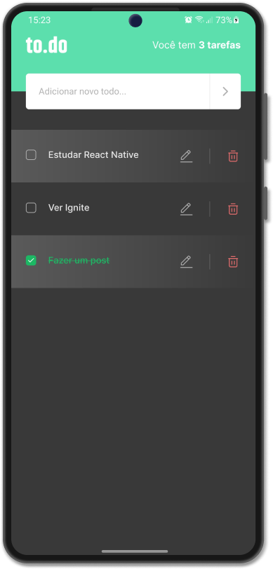

<h1 align="center">
  
</h1>

<p align="center">
  

     
</p>

<p align="center">
  
</p>

## :computer: Projeto

To.do é um app que você pode planejar seu dia adicionando todas as suas tarefas diárias de forma rápida, simples e prática.

## :zap: Tecnologias

* [React](https://pt-br.reactjs.org/)
* [Expo](https://expo.dev/)
* [TypeScript](https://www.typescriptlang.org/)

## :bookmark: Layout

O protótipo se encontra no link abaixo:

* [Protótipo - Figma](https://www.figma.com/file/a6naOrRSpLADkFwbbVAseZ/to.do)

## :rocket: Como executar

1) Clone o repositório

2) Instale as dependências com o **yarn** 

```shell
yarn install
```

3) Inicie o servidor

```shell
expo start
```

4) Com o aplicativo móvel ExpoGo, leia o QRCode.

## 🎗️ License

Este projeto está sob a licença MIT. Veja o arquivo [LICENSE](LICENSE.md) para mais detalhes.
